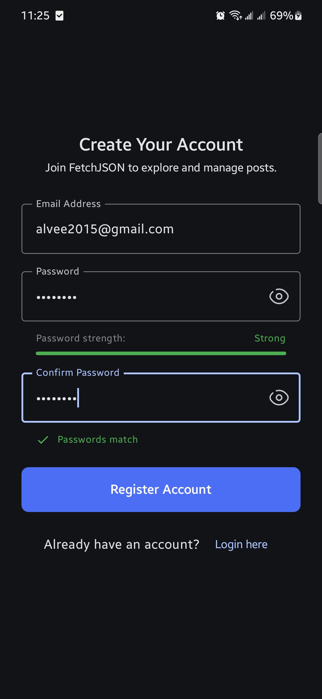
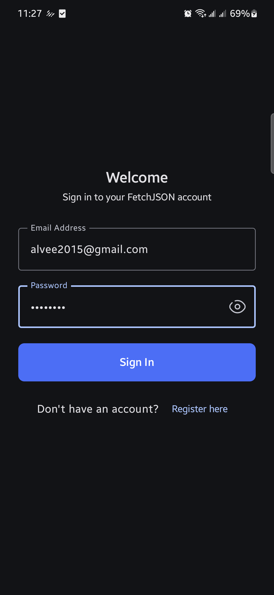
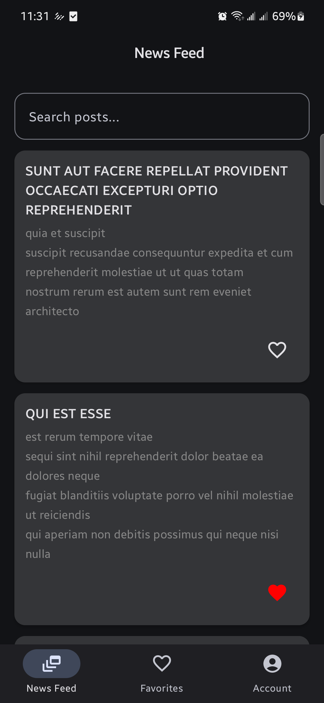
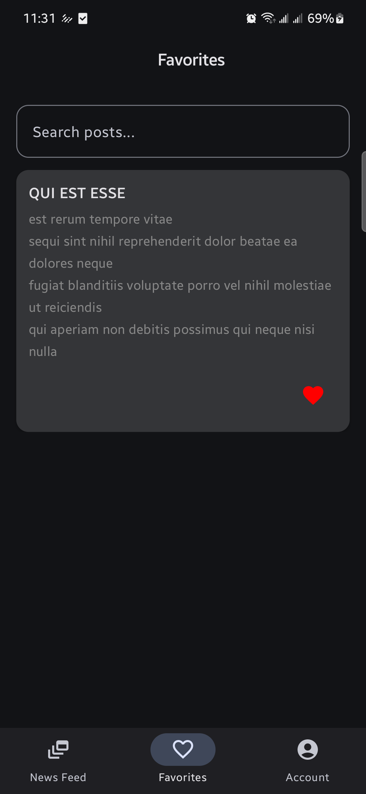
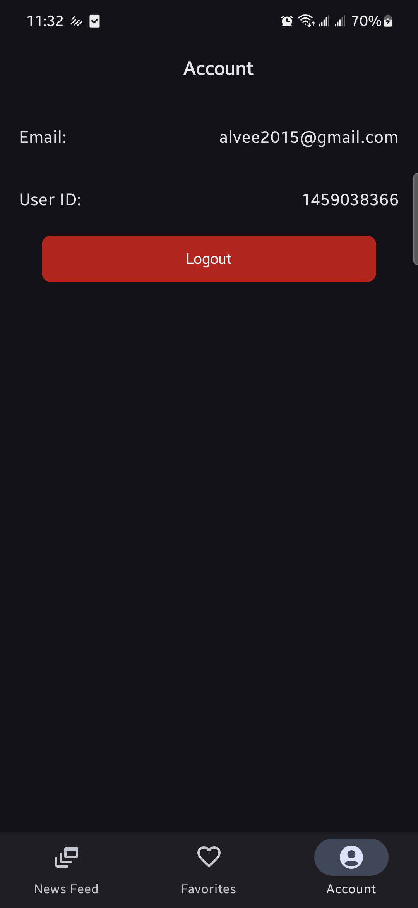

# FetchJSON - Android Application

A modern Android application built with Jetpack Compose that demonstrates fetching and displaying JSON data from remote APIs with user authentication features.

## Screenshots

<div align="center">

### Registration & Login

 &nbsp;&nbsp;&nbsp;

### News Feed & Favorites

 &nbsp;&nbsp;&nbsp;

### Account


</div>

> 

## Features

- **User Authentication**: Login and registration functionality
- **Post Feed**: Fetch and display posts from JSONPlaceholder API
- **Favorites**: Save and manage favorite posts
- **Account Management**: User profile and account settings
- **Offline Support**: Local data storage using Room database
- **Modern UI**: Built with Jetpack Compose and Material Design 3

## Setup & Build Instructions

### Prerequisites

- **Android Studio**: Arctic Fox or later
- **JDK**: Java 11 or higher
- **Android SDK**: API level 24 (Android 7.0) or higher
- **Gradle**: 8.10.1 (handled by wrapper)

### Clone and Setup

1. Clone the repository:
   ```bash
   git clone https://github.com/AlveeMorshed/FetchJSON.git
   cd FetchJSON
   ```

2. Open the project in Android Studio

3. Sync the project with Gradle files

### Build Variants

The project includes two build flavors:

- **Dev**: Development environment with debug features
  - Base URL: `https://jsonplaceholder.typicode.com`
  - Application ID suffix: `.dev`

- **Production**: Production-ready build
  - Base URL: `https://jsonplaceholder.typicode.com`
  - Application ID suffix: `.production`

### Building the App

#### From Android Studio:
1. Select the desired build variant (devDebug, productionRelease, etc.)
2. Click **Run** or use `Ctrl+R`

#### From Command Line:
```bash
# Debug build
./gradlew assembleDevDebug

# Release build
./gradlew assembleProductionRelease

# Install on device
./gradlew installDevDebug
```

### Running Tests

```bash
# Unit tests
./gradlew test

# Instrumented tests
./gradlew connectedAndroidTest
```

## App Architecture

The application follows **Clean Architecture** principles with **MVVM (Model-View-ViewModel)** pattern:

### Architecture Layers

```
📱 Presentation Layer (UI)
├── Screens (Compose UI)
├── ViewModels
├── Navigation
└── Components

🔄 Domain Layer (Business Logic)
├── Use Cases
├── Repository Interfaces
└── Domain Models

💾 Data Layer
├── Repositories (Implementation)
├── Data Sources (Remote & Local)
├── Database (Room)
└── Network (Retrofit)
```

### Project Structure

```
com.alvee.fetchjson/
├── data/
│   ├── database/          # Room database entities and DAOs
│   ├── datasource/        # Local and remote data sources
│   ├── model/            # Data transfer objects
│   ├── remote/           # API service interfaces
│   └── repository/       # Repository implementations
├── domain/
│   ├── model/            # Domain models
│   ├── repository/       # Repository interfaces
│   └── usecase/          # Business logic use cases
├── presentation/
│   ├── components/       # Reusable UI components
│   ├── navigation/       # Navigation setup
│   └── screens/          # App screens and ViewModels
├── di/                   # Dependency injection modules
├── ui/                   # Theme and UI utilities
└── utils/                # Utility classes
```

## Libraries and Technologies Used

### Core Technologies
- **Kotlin**: Primary programming language
- **Jetpack Compose**: Modern UI toolkit
- **Material Design 3**: UI design system

### Architecture & DI
- **Hilt**: Dependency injection framework
- **ViewModel**: UI-related data management
- **Navigation Compose**: Type-safe navigation

### Networking
- **Retrofit**: HTTP client for API calls
- **Gson**: JSON parsing
- **OkHttp Logging Interceptor**: Network request logging

### Local Storage
- **Room**: Local database for offline support
- **DataStore**: Preferences and settings storage


### Other Dependencies
- **Accompanist Permissions**: Runtime permission handling
- **Kotlin Coroutines**: Asynchronous programming
- **StateFlow & LiveData**: Reactive data streams

## Key Features Implementation

### Authentication
- User registration and login
- Password visibility toggle
- Email validation
- Secure local storage of user credentials
- Multiple user support

### Data Management
- Fetch posts from JSONPlaceholder API
- Local caching with Room database
- Offline-first approach
- Favorites management

### UI/UX
- Modern Material Design 3 interface
- Responsive layouts
- Loading states and error handling
- Smooth navigation between screens

## Assumptions and Limitations

### Assumptions
- **API Availability**: The app assumes JSONPlaceholder API is always available
- **Network Connectivity**: Internet connection required for initial data fetch
- **User Data**: Registration data is stored locally (not sent to a real backend)
- **Authentication**: Uses local/offline authentication (no real server validation)

### Current Limitations
- **No Real Backend**: Uses JSONPlaceholder for demo purposes only
- **Local Authentication**: User credentials are stored locally without server validation
- **Limited Offline Features**: Some features require network connectivity
- **No Data Synchronization**: No sync mechanism for offline changes
- **No Push Notifications**: Real-time updates not implemented
- **No Real-time User Switching**: No real-time or dynamic account switching

### Known Issues
- **Memory Management**: Large datasets might impact performance
- **Error Recovery**: Limited retry mechanisms for failed network requests
- **Data Validation**: Basic validation implemented (could be enhanced)

## API Integration

The app integrates with [JSONPlaceholder](https://jsonplaceholder.typicode.com/) API:

- **Base URL**: `https://jsonplaceholder.typicode.com`
- **Endpoints Used**:
  - `/posts` - Fetch all posts
  - `/posts/{id}` - Fetch specific post
  - `/users` - User information (if implemented)

## Development Notes

### Build Configuration
- **Min SDK**: API 24 (Android 7.0)
- **Target SDK**: API 35 (Android 15)
- **Compile SDK**: API 35
- **Java Version**: 11

### Code Quality
- Follows Kotlin coding conventions
- MVVM architecture pattern
- Clean Architecture principles
- Dependency injection with Hilt
- Reactive programming with Coroutines

## Screenshots Setup Guide

### Step 1: Create Screenshots Folder
Create a `screenshots` folder in your project root directory:
```
FetchJSON/
├── screenshots/          # Create this folder
│   ├── login_screen.png
│   ├── registration_screen.png
│   ├── home_screen.png
│   ├── post_feed.png
│   ├── favorites_screen.png
│   └── account_screen.png
├── app/
├── gradle/
└── README.md
```

### Step 2: Take Screenshots
1. **Run your app** on an emulator or physical device
2. **Navigate to each screen** you want to showcase
3. **Take screenshots** using:
   - **Android Studio**: Tools → Layout Inspector → Capture Screenshot
   - **Device**: Power + Volume Down buttons
   - **Emulator**: Camera icon in emulator controls

### Step 3: Optimize Screenshots
- **Recommended size**: 1080x1920 (portrait) or appropriate for your UI
- **Format**: PNG for best quality
- **File naming**: Use descriptive names (e.g., `login_screen.png`, `post_feed.png`)
- **File size**: Keep under 1MB each for faster loading

### Step 4: Organize Screenshots
Place your screenshots in the `screenshots` folder with these recommended names:
- `login_screen.png` - Login/Sign-in screen
- `registration_screen.png` - User registration screen  
- `home_screen.png` - Main home/dashboard screen
- `post_feed.png` - Posts list/feed screen
- `favorites_screen.png` - Saved/favorite posts screen
- `account_screen.png` - User profile/account screen

### Step 5: Update README (Optional)
If you want to add more screenshots or change the layout, modify the Screenshots section in README.md:

```markdown
## Screenshots
<div align="center">

</div>
```

### Tips for Better Screenshots
- **Use consistent device/emulator** for uniform appearance
- **Show key features** of each screen
- **Include loading states** if relevant
- **Use realistic data** instead of placeholder text
- **Crop properly** to focus on the app content
- **Consider dark/light themes** if your app supports both

### Alternative: Demo Video
Instead of or in addition to screenshots, you can add a demo video:
1. Record your app using screen recording
2. Upload to YouTube or similar platform
3. Add link to README:
   ```markdown
   ## Demo Video
   [](https://www.youtube.com/watch?v=YOUR_VIDEO_ID)
   ```

## Future Enhancements

- Real backend integration
- Push notifications
- Enhanced offline capabilities
- Data synchronization
- Multi-user support
- Advanced search and filtering
- Social features (comments, likes)
- Performance optimizations

---

**Package Name**: `com.alvee.fetchjson`  
**Version**: 1.0  
**Minimum Android Version**: 7.0 (API level 24)  
**Target Android Version**: 15 (API level 35)
